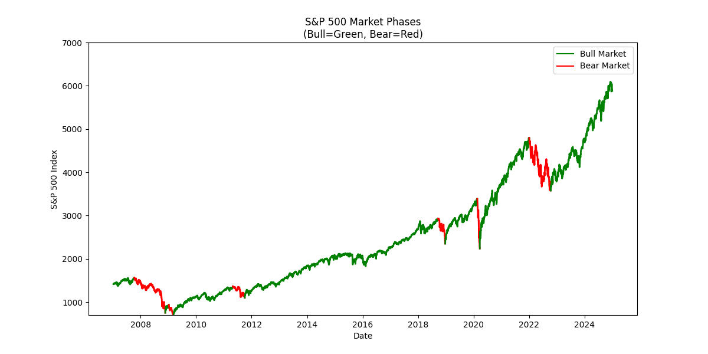
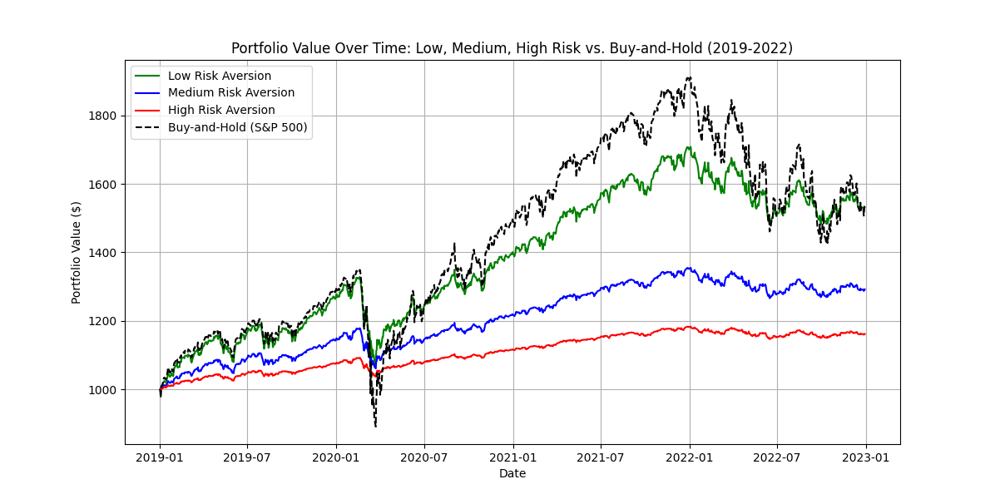
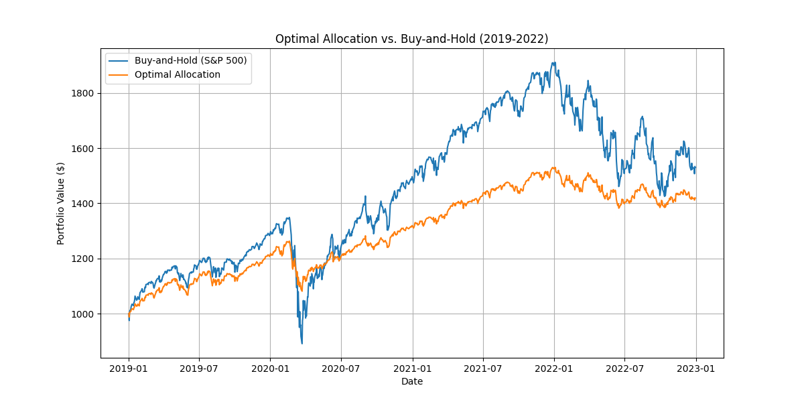
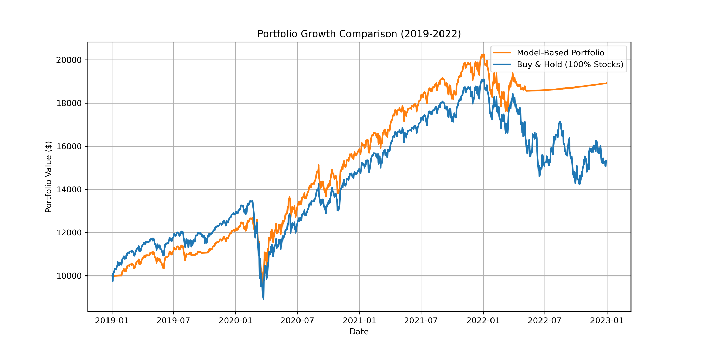

# OSU/Nationwide Quantathon 2025

This was a competition put on by SIAM2I at The Ohio State University. See our video submission/explaination <a href="https://drive.google.com/file/d/1h4N3RjLH-XjKPAP8to0RS05v47MpgV1W/view?usp=sharing">at this link</a>.

## Problem Statement

Our goal was to answer 3 questions:

<ol>
<li>Can we find/classify Bear and Bull Markets?</li>
<li>Can market-based probabilities predict Bear and Bull markets?</li>
<li>Can we create a model/investment strategy which can beat or be more reliable than Buy-and-Hold for 2019-2022?</li>
</ol>

For more info, check out the formal problem description in "2025 Quantathon Problem.pdf".

## Data Analysis

We were able to find some correlations between the probabilities and market trends, as well as verify the accuracy of the provided predictions (97.39%). This gave us the confidence to move forward and use this data to train some AI/ML Models.

To see our visualizations, check out and run the files in 'data-visualizations/'. To see our data analysis scripts, check out 'python-data-analysis/'.

## Model 1: Linear Regression

Our first model was a Linear Regression Model trained on the data from 2007 to 2018. It predicted stock volatility for 2019, which, in combination with  Modern Portfolio Theory (MPT), and a risk aversion coefficent, could be used to determine daily Stock/Bond portfolio allocation.

Once we had this model, we could find the optimal risk aversion coefficent to maximize the Sharpe Ratio for our strategy. The S&P500 has a Sharpe Ratio of 0.535, while our model had one of 0.870. This let us conclude that we had made a safer strategy for investors than Buy-and-Hold.

## Model 2: Neural Network

Now that we had a safer strategy, we wanted to try to be more profitable than Buy-and-Hold. To do this, we thought our best attempt was a Neural Network. We trained the network on the market data for 2007-2018, and it was able to beat Buy-and-Hold by about 130%. ...However, this result only had a P value of 0.769, so we were unable to confidently conclude our model truly was more profitable than Buy-and-Hold. (However, if we assume this is an efficent market, the fact we cannot confidently beat it is expected)

## Conclusions

<ul>
<li>Yes, we can classify Bear and Bull Markets.</li>
<li>Market based probabilities CAN be used to predict these markets.</li>
<li>We can certainly provide a safer investment strategy for investors than Buy-and-Hold, but even though we did beat Buy-and-Hold with out Neural Network, we cannot confidently conclude that it was truly more profitable.</li>
</ul>

## Team

<ul>
<li>Caden Conde, CIS Major</li>
<li>Arjun Anand, CSE Major</li>
<li>Rishabh Bhargava, CSE Major</li>
<li>Auritro Saha, CSE Major</li>
<li>Ryan Lee, Logistics Major</li>
</ul>
